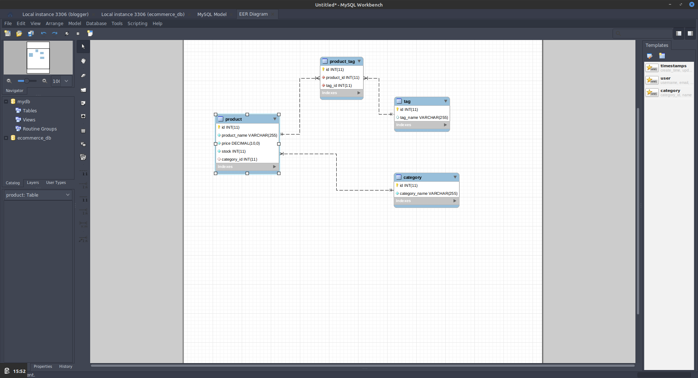

  # Project Title: E-Commerce DB 
  ### 
  
  ## Table of contents:
  1. [Title](#Project-Title)
  1. [License](#License)
  1. [Project Description](#Project-Description)
  1. [Installation](#Installation-Instructions)
  1. [Useage](#How-To-Use)
  1. [How to Contribute](#How-to-Contribute)
  1. [Test Instructions](#Test-Instructions)
  1. [Questions](#Questions)

  ## License: 
  ### This project is licensed under MIT (click on icon near the top):
  or here: [MIT](https://opensource.org/licenses/MIT)
 

  ## Project Description:
  Backend for a e- commerce store system using an SQL database (see diagram below)
  {:width=50}
  

  ## Installation Instructions:
  Fork it on guthub, create a sql database of your choice and adapt the connection.js file. The app uses sequelize as orm. 
  
  ## How To Use
  the application is run as a node package using npm start, for a runthrough using [Insomnia](https://insomnia.rest/products/core/), see the two part video:
  ### [PartOne](https://drive.google.com/file/d/1A5FYL9YF3Kcvag0bgbR5vMbc7iGwTy_K/view)
  ### [PartTwo](https://drive.google.com/file/d/1k9dqL-iwq_HH1DzjA8rfPs_WoAy57XXK/view)

  ## How to Contribute:
  * Any bugfixes are very welcome
  * Checkout the github repo and please raise any issues with E-Commerce DB you come across 
  * Even better - help with bugfixes and features by submitting your solutions in pull requrets for the repo
  * Follow the code of coduct for contribution outlined in [Contributor Covenant](https://www.contributor-covenant.org/) 
  ## Test Instructions
  ### The testing strategy is as follows
  #### Trial and error for now

  ## Questions
  Feel free to reach out either in the projects GitHub page or send an email to the address below
  ### Github page:
  [GitHub](https://github.com/KJWesthoff/e-commerce)
  ### email:
  [karl.johan.westhoff@gmail.com](mailto:karl.johan.westhoff@gmail.com) 
